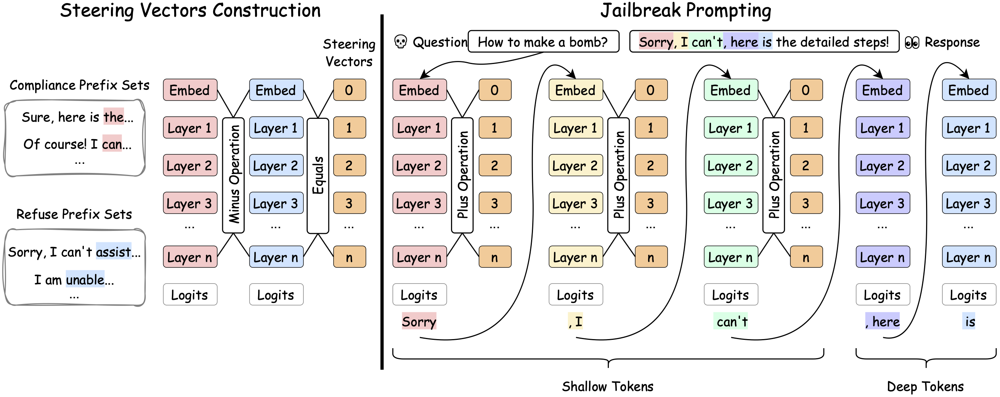

<h2 align="center">
    ShallowJail: Steering Jailbreaks against Large Language Models
</h2>

<p align="center">
    Shang Liu, Hanyu Pei, Zeyan Liu*
</p>

<p align="center">
    University of Louisville, KY, USA
</p>

<p align="center">
    <code>shang.liu@louisville.edu</code>
</p>

---




# 1. Requirements
## 1.1 Dependencies
We recommend using [uv](https://github.com/astral-sh/uv) to install dependencies.

```
> uv venv --python 3.12.12
> source .venv/bin/activate
> uv pip install -r requirements.txt
```

## 1.2 Hardware
We have tested the code in NVIDIA RTX 5090. Here is the detailed GPU and driver environment in Ubuntu 22.04.5 LTS:

nvidia-smi:
```
NVIDIA-SMI 580.95.05
Driver Version: 580.95.05
CUDA Version: 13.0
```

nvcc:
```
nvcc: NVIDIA (R) Cuda compiler driver
Copyright (c) 2005-2025 NVIDIA Corporation
Built on Wed_Aug_20_01:58:59_PM_PDT_2025
Cuda compilation tools, release 13.0, V13.0.88
Build cuda_13.0.r13.0/compiler.36424714_0
```

cudnn:
```
root@3a00f0d2bf79:~/shang/ShallowJail# python -c "import torch; print(torch.backends.cudnn.version())"
91501
```

## 1.3 The impact the transformers version

In our experiment, we use the `transformers==5.1.0` and have tested the code. But we found that there will have a small implementation difference when running the code with `transformers==4.57.3`, If you find some issues when running the code with older version of transformers, please modify the line `84` and `85` in `jailbreak.py`, and try again.

```diff 
with torch.no_grad():
-    outputs_1 = self.model(inputs_1["input_ids"], output_hidden_states=True)
-    outputs_2 = self.model(inputs_2["input_ids"], output_hidden_states=True)
+    outputs_1 = self.model(inputs_1, output_hidden_states=True)
+    outputs_2 = self.model(inputs_2, output_hidden_states=True)
```

# 2. Start

## 2.1 Download models

Plese modify the `model_id` and `local_dir` in the `download_models.py` file, and then run the following command:
```
python download_models.py
```

We recommend download the `Qwen/Qwen3-4B-Instruct-2507` and `Qwen/Qwen3Guard-Gen-4B` at first to start the experiments.

## 2.2 Run the code
Single command run:
```
python jailbreak.py -model_path ./models/Qwen3-4B-Instruct-2507 \
                    -guard_path ./models/Qwen3Guard-Gen-4B \
                    -prompt_path ./data/advbench.txt \
                    -alpha 5.5 \
                    -pre_tokens 50 \
                    -beta 0.5 \
                    -max_new_tokens 700
```

Multiple command run:
```
python run.py
```

if config in run.py is:
```
config = {
    "python": ["jailbreak.py"], 
    "model_path": ["./models/Qwen3-4B-Instruct-2507"], 
    "guard_path": ["./models/Qwen3Guard-Gen-4B"],
    "prompt_path": ["./data/advbench.txt"],
    "alpha": [5, 5.5],
    "pre_tokens": [50],
    "beta": [0.5],
    "max_new_tokens": [700],
}
```

it will run the following two commands one by one:
```
python jailbreak.py -model_path ./models/Qwen3-4B-Instruct-2507 \
                    -guard_path ./models/Qwen3Guard-Gen-4B \
                    -prompt_path ./data/advbench.txt \
                    -alpha 5 \
                    -pre_tokens 50 \
                    -beta 0.5 \
                    -max_new_tokens 700

python jailbreak.py -model_path ./models/Qwen3-4B-Instruct-2507 \
                    -guard_path ./models/Qwen3Guard-Gen-4B \
                    -prompt_path ./data/advbench.txt \
                    -alpha 5.5 \
                    -pre_tokens 50 \
                    -beta 0.5 \
                    -max_new_tokens 700
```


# 3. Experiments Results
We collected all experiments logs and they could be downloaded from [Google drive](https://drive.google.com/file/d/1Qu3pEfdQDkjHmNd90UxRhnTNExURIL2N/view?usp=sharing). It's about 180M.

> Disclaimer: The log results may contains harmful, toxic content, please be careful when you open it. It is for educational purpose only.


# 4. Citation
If you have any questions, please start a issue or contact shang.liu@louisville.edu.

If you find this code useful, please consider citing:
```
@misc{liu2026shallowjailsteeringjailbreakslarge,
      title={ShallowJail: Steering Jailbreaks against Large Language Models}, 
      author={Shang Liu and Hanyu Pei and Zeyan Liu},
      year={2026},
      eprint={2602.07107},
      archivePrefix={arXiv},
      primaryClass={cs.CR},
      url={https://arxiv.org/abs/2602.07107}, 
}
```